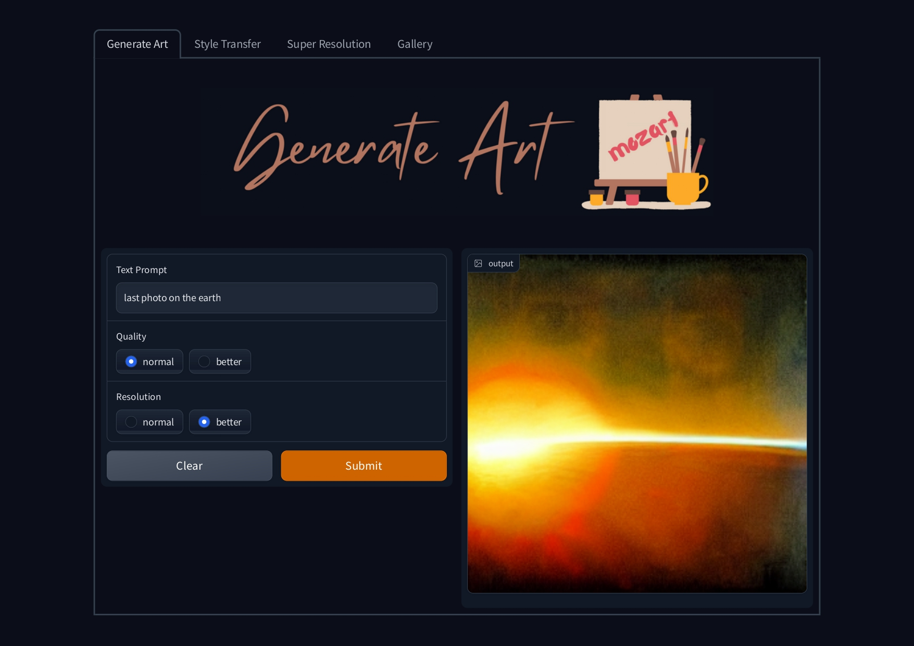

# Mozart: A Generative Art Platform


Welcome to Mozart, a generative art platform that uses advanced machine learning techniques to create unique, one-of-a-kind artworks based on user text prompts. With Mozart, you can easily explore and generate new art pieces using a simple, intuitive interface.

The name **Mozart** was chosen for this project because Wolfgang Amadeus Mozart is credited with creating a musical game form called **Musikalisches Würfelspiel** (Musical Dice Game), which is the oldest known example of generative art. In this game, players would roll dice to generate random numbers, which were then used to select musical phrases from a pre-determined list. These phrases were then combined to create a unique piece of music.

Like Mozart's Musical Dice Game, the Mozart generative art platform uses advanced algorithms and machine learning techniques to generate unique art pieces based on user input. With Mozart, you can create your own one-of-a-kind artworks by simply entering a text prompt and adjusting the parameters of the Latent Diffusion Model (LDM) and using the Neural Style Transfer and Super Resolution features.

## Screenshot

Here is a screenshot of the Mozart platform:

<p align="center">

</p>

## Motive

The motive for this project was to create a fun and interactive way for users to generate unique art pieces using advanced machine learning techniques. It was also a personal project built as a way to learn and experiment with different machine learning models and techniques. This project was developed for the "Project Sprint" Competition conducted by The Turing Club and is not a real business or a website.

## Technologies used:

* [Latent Diffusion](https://github.com/CompVis/latent-diffusion) for generating art from text prompts.
* [Neural Style Transfer](https://www.tensorflow.org/tutorials/generative/style_transfer) for transferring an image's style onto another image.
* [Torch-SRGAN](https://deepai.org/machine-learning-model/torch-srgan) for Super-Resolution.

## Features

- Generate unique art pieces using Latent Diffusion Model (LDM)
- Choose between different quality and resolution options
- Use Neural Style Transfer to apply the style of one image to another
- Enhance the resolution of an image using Super Resolution
- Save your favorite artworks and share them with friends

## Getting Started

To get started with Mozart, follow these steps:

1. Make sure you have a Google account, and go to [Google Colaboratory](https://colab.research.google.com/).
2. Click the "File" menu and select "Open notebook."
3. Choose the "mozart_latent_diffusion.ipynb" file from your local machine or GitHub repository.
4. Click the "Connect" button to connect to a runtime.
5. In the "Connect to a runtime" window, select "Runtime" and then "Change runtime type."
6. In the "Hardware accelerator" dropdown, select "GPU" and then click the "Save" button.
7. Click on "Run all" in Google Colaboratory to execute the code in the notebook.
8. Follow the instructions in the notebook to generate your own art pieces using the LDM. You can choose between Normal and Better quality options, and Normal and Better resolution options to customize your art.
9. You can also use Neural Style Transfer or Super Resolution to further customize your art.


## Contact

If you have any questions or suggestions, you can contact the developers via Discord:

- Bharath Raj: ```j#9272```
- Raghavendra Dabral: ```ixtab#0099```
